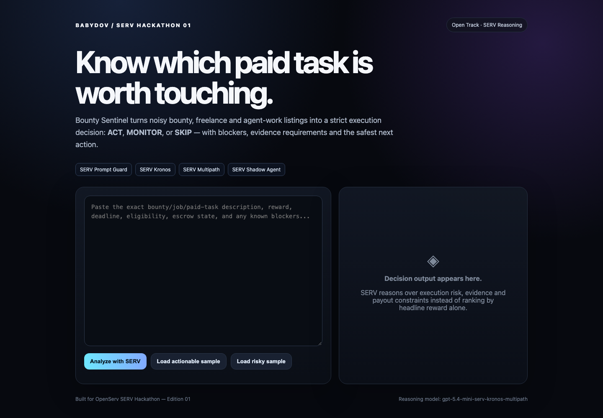

# SERV Hackathon #1 — Open Track Submission

## BABYDOV Bounty Sentinel

**Builder:** Ivan Babydov / BABYDOV  
**Track:** Open Track  
**Repository:** https://github.com/williamleewilliam1-star/babydov-bounty-sentinel

### Concept

BABYDOV Bounty Sentinel is a SERV-powered decision gate for autonomous earning agents. It turns noisy bounty, freelance, and agent-work listings into one strict execution decision — **ACT**, **MONITOR**, or **SKIP** — with blockers, risk flags, evidence requirements, confidence, and the smallest safe next action.

Instead of sorting by headline reward, it reasons over execution reality: payment terms, deadlines, duplicate/claim state, deposits, wallet-signature requirements, identity gates, and evidence quality.

### SERV Reasoning integration

The product calls the OpenAI-compatible SERV endpoint at `https://inference-api.openserv.ai/v1` with model `gpt-5.4-mini-serv-kronos-multipath`.

Enabled SERV features:

- Prompt Guard
- Kronos
- Multipath
- Shadow Agent

The SERV API key remains server-side and is never exposed to the browser.

### Working evidence

End-to-end validation against the live SERV API on 27 September 2026 returned HTTP 200 and a structured `ACT` decision with 82% confidence for the included funded-task sample. The recorded OpenServ request ID was `chatcmpl-ESibKmnHhJfKb4BMyVGnnzhax916J`.

### Revenue potential

The same reasoning gate can sit between opportunity discovery and autonomous execution for bounty scanners, freelance agents, procurement agents, and paid-task marketplaces, reducing wasted compute and preventing unsafe or unfunded actions.
